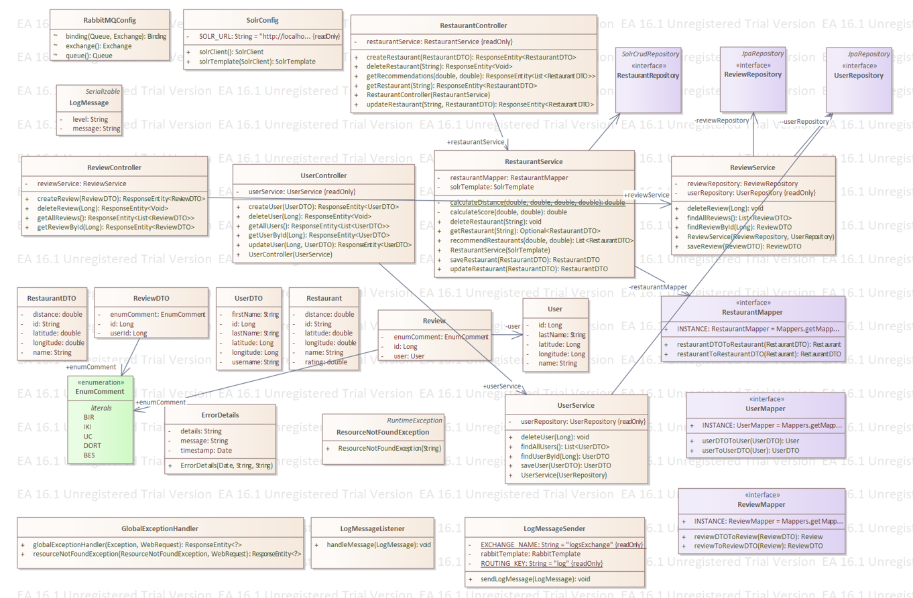

# Spring Boot Restaurant and Reviews Management System

This project is a RESTful API developed using Spring Boot, focusing on managing restaurants and user reviews. It integrates technologies such as RabbitMQ for message handling, Solr for advanced search capabilities, and JPA/Hibernate for ORM.

## Project Description

The project offers functionalities such as searching for restaurants, posting reviews, and managing user accounts. It utilizes RabbitMQ for logging messages and Solr for enhanced search functionality across restaurants.

## Class Diagram

## Swagger Page

## Project Structure

The project includes the following main packages and classes:

- `config`: Contains configurations for RabbitMQ and Solr.
- `controller`: RESTful API endpoints for restaurant, review, and user operations.
- `dao`: Data access layer, containing repository classes.
- `dto`: Data Transfer Objects used for data transmission through the API.
- `entity`: Represents database entities.
- `enums`: Defines constant values.
- `errormessage`: Defines error messages.
- `exceptions`: Contains custom exception classes.
- `global`: Contains global classes and exception handlers.
- `listener`: Includes RabbitMQ message listeners.
- `mapper`: Facilitates data conversion between DTOs and entity classes.
- `model`: Defines models used within the application.
- `service`: Service classes that execute business logic.

## Installation and Running

### Prerequisites

- Java JDK 11 or above
- Maven
- RabbitMQ
- Solr
